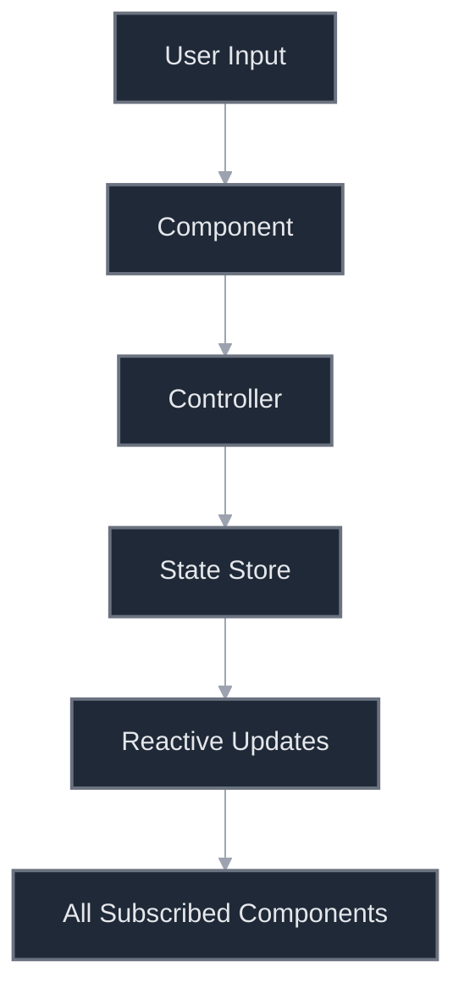

MASSIVE refactoring completed. Theoretically, it should be near perfect code. Let's find out...

---

## VideoFabricWithZoom Feature Architecture

### 🏗️ Overall Architecture Pattern

The feature follows a **layered, component-based architecture** with clear separation of concerns:

```
┌─────────────────────────────────────────────┐
│             User Interface Layer            │
│  (Svelte Components with Reactive Bindings) │
├─────────────────────────────────────────────┤
│            Controller Layer                 │
│  (Business Logic & Coordination)            │
├─────────────────────────────────────────────┤
│            State Management Layer           │
│    (Svelte 5 Runes-based Stores)            │
├─────────────────────────────────────────────┤
│            Service Layer                    │
│  (External Library Integration)             │
├─────────────────────────────────────────────┤
│            Utility Layer                    │
│    (Performance, Helpers, Gestures)         │
└─────────────────────────────────────────────┘
```

### 📁 Directory Structure & Responsibilities

```
videoFabricWithZoom/
├── components/           # UI Components (View Layer)
│   ├── VideoCanvas/     # Core video/canvas components
│   ├── Controls/        # User interaction controls
│   ├── Navigation/      # Minimap navigation
│   └── Diagnostics/     # Development/debugging tools
├── controllers/         # Business Logic (Controller Layer)
├── stores/             # State Management (Model Layer)
├── services/           # External integrations
├── types/              # TypeScript definitions
├── utils/              # Helper functions
└── tests/              # Component tests
```

### 🎯 Core Architectural Principles

#### 1. **Separation of Concerns**

- **Components**: Pure UI rendering and event handling
- **Controllers**: Complex business logic and coordination
- **Stores**: Centralized state management
- **Services**: External library abstractions

#### 2. **Reactive State Management**

Uses Svelte 5's rune system for reactive state:

```typescript
class VideoState {
  player = $state<Player | null>(null);      // Reactive state
  currentTime = $state(0);
  duration = $state(0);
  aspectRatio = $derived(() =>               // Computed values
    this.width / this.height
  );
}
```

#### 3. **Layered Rendering Architecture**

```
Container
├── Video Layer (bottom)     - Video.js player
├── Canvas Layer (middle)    - Fabric.js annotations
└── Control Layer (top)      - UI controls
```

### 🔄 State Management Architecture

#### **Three Primary State Stores**

1. **VideoState** - Video playback management
    
    - Player reference
    - Playback state (time, duration, paused)
    - Video dimensions
    - Loading/error states
2. **CanvasState** - Drawing and annotations
    
    - Fabric.js canvas reference
    - Active drawing tool
    - Drawing properties (colors, stroke width)
    - Annotation collection
3. **TransformState** - Zoom/pan transformations
    
    - Zoom level and boundaries
    - Pan position with constraints
    - Viewport transform matrix
    - Derived calculations for boundaries

### 🎮 Controller Architecture

Controllers act as **coordinators** between components and stores:

```typescript
// Example: ZoomController
class ZoomController {
  private zoomLevel = $state(1.0);
  private panX = $state(0);
  private panY = $state(0);
  
  // Smooth zoom with animation
  private interpolateZoom(targetZoom, focusPoint, duration);
  
  // Multiple input handlers
  handleWheel(event, containerRect);
  handleKeyboard(event);
  handlePinch(scale, midpoint);
}
```

**Key Controllers:**

- `ZoomController` - Zoom/pan logic with animations
- `DrawingController` - Drawing tool management
- `VideoCanvasSync` - Synchronizes video/canvas
- `PanController` - Pan gesture handling
- `MinimapController` - Minimap viewport calculations

### 🔌 Component Communication Pattern




Components communicate through:

1. **Props** for parent-child data flow
2. **Shared stores** for cross-component state
3. **Controllers** for complex interactions
4. **Events** for child-to-parent communication

### 🎨 Canvas & Video Synchronization

The architecture ensures pixel-perfect alignment:

1. **Unified Transform Application**
    
    ```svelte
    <div style="transform: scale({zoom}) translate({panX}px, {panY}px)">
      <VideoLayer />
      <CanvasLayer />
    </div>
    ```
    
2. **Coordinate System Management**
    
    - Video coordinates (original dimensions)
    - Display coordinates (scaled to container)
    - Canvas coordinates (matches display)
    - Minimap coordinates (scaled preview)

### ⚡ Performance Architecture

1. **Throttling/Debouncing**
    
    ```typescript
    const handleWheel = throttle(actualHandler, 16); // 60fps
    const handleResize = debounce(actualHandler, 250);
    ```
    
2. **Frame-based Updates**
    
    ```typescript
    class PerformanceOptimizer {
      registerFrameCallback(callback);  // RAF coordination
      scheduleFrame();                   // Batched updates
    }
    ```
    
3. **Memory Management**
    
    - Canvas object pooling
    - Disposal patterns for cleanup
    - Frame caching in minimap

### 🔧 Dependency Injection Pattern

Uses a service locator pattern for external libraries:

```typescript
// Services are abstracted behind interfaces
VideoService -> Video.js
CanvasService -> Fabric.js
```

### 🧩 Key Architectural Decisions

1. **Svelte 5 Runes over Stores**
    
    - Better TypeScript support
    - Cleaner syntax
    - Built-in computed values
2. **Class-based State Management**
    
    - Encapsulates related state and methods
    - Clear API boundaries
    - Easy testing
3. **Controller Pattern**
    
    - Separates complex logic from components
    - Reusable across different UIs
    - Testable in isolation
4. **Unified Transform System**
    
    - Single source of truth for zoom/pan
    - Synchronized updates across layers
    - Pan boundaries calculation
5. **Feature-based Organization**
    
    - All related code in one place
    - Clear dependencies
    - Easy to extract/reuse

### 🔄 Data Flow Architecture

```
User Action → Component Event → Controller Method → Store Update
     ↓                                                    ↓
UI Feedback ← Component Re-render ← Reactive Binding ← State Change
```

### 🎯 Architecture Strengths

1. **Modularity** - Components can be used independently
2. **Testability** - Clear boundaries for unit testing
3. **Performance** - Optimized rendering pipeline
4. **Maintainability** - Clear separation of concerns
5. **Extensibility** - Easy to add new tools/features
6. **Type Safety** - Full TypeScript coverage

This architecture provides a robust foundation for complex video annotation features while maintaining performance and code quality.

---
